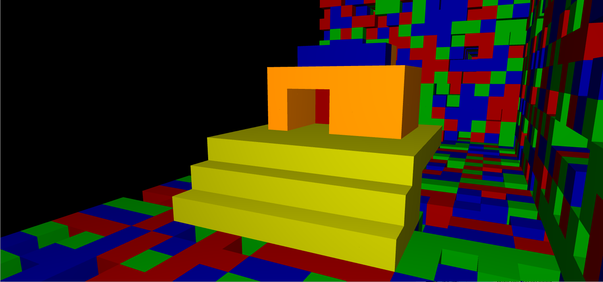

# VoxelEngine

# Description 
A basic voxel engine made with pure OpenGL and C++ that implements an editable block world, simple rendering, lighting and collision detection. Made for learning purposes.
# How to run
Download all files in release directory and run the .exe in a path wich contains all other files.
# Controls
W,A,S,D,Shift and space controls the camera, R,F and the arrows controls the only collision affected yellow box initially placed at the top of the world. 
